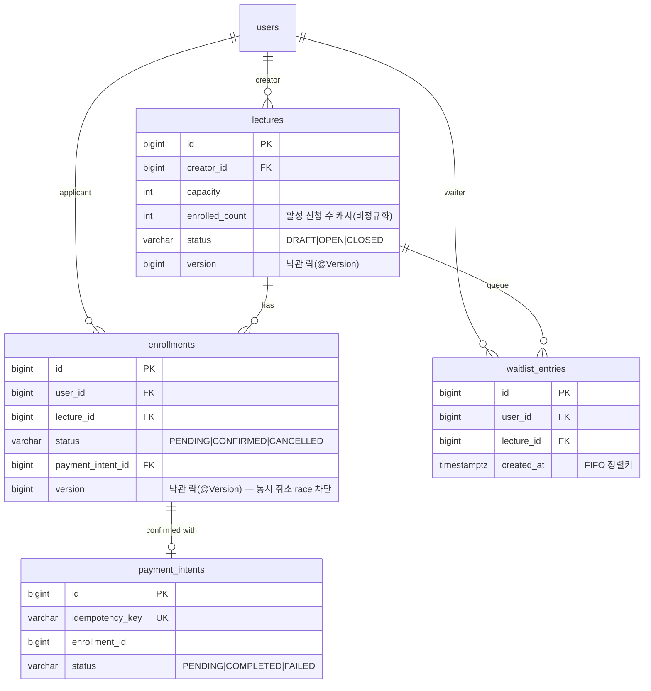
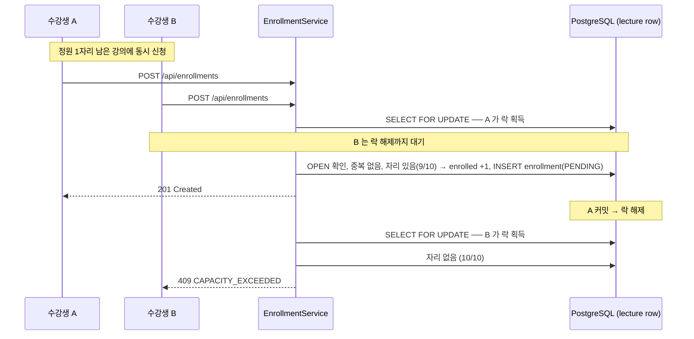

# liveklass-be-assignment — 수강 신청 시스템 (BE-A)

[](https://github.com/dolmaroyujinpark/liveklass-be-assignment/actions/workflows/ci.yml)

크리에이터가 강의를 개설하고 수강생이 신청·결제·취소하는 백엔드 API입니다. 핵심 도전은 **동시성 제어**(마지막 자리 동시 신청)와 **상태 전이 정확성**입니다.

---

## 프로젝트 개요

| 항목 | 값 |
|---|---|
| 과제 | BE-A 수강 신청 시스템 (Backend · CRUD + 비즈니스 규칙) |
| 도메인 | 강의 개설/조회/상태 전이, 수강 신청/결제/취소, 대기열 |
| 핵심 도전 | 동시성 제어(정원 경쟁), 상태 전이(FSM), 결제 멱등성 |
| 제출 | GitHub: [dolmaroyujinpark/liveklass-be-assignment](https://github.com/dolmaroyujinpark/liveklass-be-assignment), `main` 브랜치 실행 가능 |

---

## 기술 스택

| 분류 | 선택 | 이유 |
|---|---|---|
| 언어 / 프레임워크 | Java 17 · Spring Boot 3.3 | 명세 권장 스택, 평가자 친화 |
| ORM | Spring Data JPA + Hibernate | 도메인 모델 + 트랜잭션 일관성 |
| DB | **PostgreSQL 16** | 부분 UNIQUE 인덱스, `SELECT … FOR UPDATE SKIP LOCKED`, row-level 락 (아래 "설계 결정과 이유") |
| 마이그레이션 | Flyway (`ddl-auto: validate`) | 스키마 변경 추적 |
| API 문서 | springdoc-openapi (Swagger UI) | 자동 문서화 |
| 빌드 | Gradle 8.10.2 (Kotlin DSL, wrapper 고정) | 평가자 환경 의존성 최소화 |
| 테스트 | JUnit 5 · Mockito · Spring Boot Test · **Testcontainers** | 단위 + 실 PostgreSQL 통합 |
| 부하 테스트 | K6 | 동시 신청 시나리오 |
| 로깅 | logback + logstash-logback-encoder (JSON) + MDC traceId | 운영 환경 구조화 로깅 |
| 컨테이너 / CI | Docker Compose · GitHub Actions | 한 줄 실행 + 자동 빌드·테스트 |

자유 라이브러리 선택의 이유는 위 표와 아래 "설계 결정과 이유" 섹션에 있습니다.

---

## 실행 방법

전제로 JDK 17과 Docker가 필요합니다.

### 옵션 1 — 로컬 앱 + Docker PostgreSQL (개발용)
```bash
docker compose up -d postgres            # PostgreSQL 16 (포트 5432)
./gradlew bootRun                        # 앱 (포트 8080), local 프로필 — 시드 데이터 자동 생성
curl http://localhost:8080/health        # → {"status":"UP"}
```

### 옵션 2 — 전부 Docker (한 줄, 평가용)
```bash
./gradlew bootJar
docker compose --profile app up          # 앱 + PostgreSQL, docker 프로필 — 시드 자동, JSON 로그
```

- Swagger UI: <http://localhost:8080/swagger-ui.html>, OpenAPI 스펙은 `/v3/api-docs` 입니다.
- Actuator: `/actuator/health` (DB 연결 포함), `/actuator/metrics`, `/actuator/prometheus`.

시드 데이터:
- `local` / `docker` 프로필에서 **빈 DB 최초 실행 시** 데모용 시드가 자동 생성됩니다 (결정론적, seed=42 — 사용자 35명: 크리에이터 id 1~5, 클래스메이트 id 6~35, 강의 20개: DRAFT 3 / OPEN 14 / CLOSED 3).
- 기존 데이터가 있으면 시드는 다시 생성되지 않습니다.
- 시드를 초기화하려면 `docker compose down -v` 후 재실행합니다.

---

## 구현 범위

명세가 명시한 것(필수 / 선택), 명세에 직접 적히지 않았지만 구현에 필요한 것, 자발적으로 더한 것으로 나눠 정리합니다. 항목별 코드 위치는 [docs/SCOPE.md](docs/SCOPE.md) 에 있습니다.

### 명세 명시 — 필수 (10)
- 강의 등록 (제목·설명·가격·정원·기간)
- 강의 상태 전이 (DRAFT → OPEN → CLOSED)
- 강의 목록 조회 (status 필터)
- 강의 상세 조회 (현재 신청 인원 포함)
- 수강 신청 (PENDING)
- 결제 확정 (PENDING → CONFIRMED)
- 수강 취소 (→ CANCELLED)
- 내 수강 신청 목록 조회
- 정원 초과 신청 거부
- 동시성 제어 — 마지막 자리에 동시에 신청해도 정확히 정원 수만 성공

### 명세 명시 — 선택 / 추가 점수 (4)
- 수강 취소 가능 기간 제한 (결제 후 7일, 설정값)
- 대기열 — 등록(`POST /api/lectures/{id}/waitlist`) / 크리에이터 조회
- 강의별 수강생 목록 조회 (크리에이터 전용)
- 신청 내역 페이지네이션

### 명세에 명시되진 않았지만 구현에 필요한 것 (암묵적 요구)
- **동시성 다층 방어** — 비관 락(`SELECT … FOR UPDATE`) + `@Version` 낙관 락 + 부분 UNIQUE 인덱스. "동시 신청을 고려" 라는 요구를 실제로 보장
- **결제 멱등성** — `Idempotency-Key` 헤더 + `payment_intents.idempotency_key` UNIQUE. 결제 재시도가 두 번 처리되지 않음
- **명시적 상태 머신** — 상태 전이 검증을 도메인 메서드에 두고 잘못된 전이를 차단(→ 409)
- **동일 강의 중복 신청 방지** — 부분 UNIQUE 인덱스 (취소 후 재신청은 허용)
- **권한 검사** — 본인만 자기 신청 취소, 강의 작성 크리에이터만 상태 전이·수강생/대기열 조회
- **일관된 에러 응답** — RFC 7807 `application/problem+json` + `code` 식별자
- **강의 목록 페이지네이션** — 명세는 "신청 내역" 만 명시했으나 강의 목록에도 적용

### 자발적 차별화 — 검증·운영·문서
- **테스트** — Testcontainers 동시성 통합 테스트(`ConcurrencyTest`), K6 부하 테스트 스크립트
- **CI** — GitHub Actions (push/PR 마다 빌드 + 전체 테스트)
- **실행** — Docker Compose 한 줄 실행 (앱 + PostgreSQL)
- **API 문서** — OpenAPI / Swagger UI 자동 문서화
- **로깅·운영** — 구조화 로깅 (JSON + 요청별 traceId/MDC), Spring Boot Actuator (헬스·메트릭)
- **다이어그램** — Mermaid ERD / 동시 신청 시퀀스 (README)
- **문서** — `docs/API.md`, `docs/CONCURRENCY.md`, `docs/TEST.md`, `docs/AI_USAGE.md` 등

---

## API 목록 및 예시

전체 명세·요청/응답 예시·에러 코드 표는 [docs/API.md](docs/API.md) 에 있고, 인터랙티브 문서는 Swagger UI 에서 확인할 수 있습니다.

| 메서드 | 경로 | 설명 | 분류 |
|---|---|---|---|
| GET | `/health` | 헬스체크 | `[필수]` |
| POST | `/api/lectures` | 강의 등록 (CREATOR) | `[필수]` |
| GET | `/api/lectures` | 목록 조회 (status 필터, page/size) | `[필수][선택]` |
| GET | `/api/lectures/{id}` | 상세 조회 (현재 신청 인원 포함) | `[필수]` |
| PATCH | `/api/lectures/{id}/status` | 상태 전이 (작성 크리에이터) | `[필수]` |
| GET | `/api/lectures/{id}/enrollments` | 강의별 수강생 목록 (크리에이터 전용, page/size) | `[선택]` |
| POST | `/api/lectures/{id}/waitlist` | 대기열 등록 | `[선택]` |
| GET | `/api/lectures/{id}/waitlist` | 대기열 조회 (크리에이터 전용, page/size) | `[선택]` |
| POST | `/api/enrollments` | 수강 신청 (PENDING) | `[필수]` |
| POST | `/api/enrollments/{id}/payment` | 결제 확정 (`Idempotency-Key` 헤더) | `[필수][추가]` |
| DELETE | `/api/enrollments/{id}` | 수강 취소 | `[필수][선택]` |
| GET | `/api/enrollments/me` | 내 수강 신청 목록 (page/size) | `[필수][선택]` |

- 인증은 상태를 바꾸거나 권한이 필요한 요청에 헤더 `X-User-Id: <userId>` 를 사용합니다(명세에서 허용한 간이 방식). 인가는 역할 검사(CREATOR)와 소유자 검사(강의 작성자/신청 본인)로 처리합니다.
- 에러 응답은 RFC 7807 `application/problem+json` 형식입니다 — `{ type, title, status, detail, code }`.

예시:
```bash
# 강의 등록 (크리에이터 id 1) → OPEN 전환
curl -X POST localhost:8080/api/lectures -H 'X-User-Id: 1' -H 'Content-Type: application/json' \
  -d '{"title":"Spring Boot 백엔드","price":199000,"capacity":20,"startDate":"2026-06-01","endDate":"2026-07-01"}'
curl -X PATCH localhost:8080/api/lectures/21/status -H 'X-User-Id: 1' -H 'Content-Type: application/json' -d '{"status":"OPEN"}'

# 신청 (수강생 id 6) → 결제 → 취소
curl -X POST localhost:8080/api/enrollments -H 'X-User-Id: 6' -H 'Content-Type: application/json' -d '{"lectureId":21}'
curl -X POST localhost:8080/api/enrollments/101/payment -H 'X-User-Id: 6' -H 'Idempotency-Key: pay-101-abc'
curl -X DELETE localhost:8080/api/enrollments/101 -H 'X-User-Id: 6'
```

---

## 데이터 모델 설명


> 전체 컬럼은 [docs/ERD.md](docs/ERD.md) 와 `V1__init.sql` 에서 확인할 수 있습니다. (users 는 `id`, `name`, `role[CREATOR|CLASSMATE]` 입니다.)

핵심 제약/인덱스는 다음과 같습니다.
- **`uq_enrollments_active`** — `UNIQUE (user_id, lecture_id) WHERE status <> 'CANCELLED'` (부분 인덱스): 동일 사용자가 동일 강의에 active 신청을 1개만 가질 수 있고, CANCELLED 는 이력으로 남아 재신청이 가능합니다.
- **`payment_intents.idempotency_key UNIQUE`** — 결제 확정 멱등성의 최종 방어선입니다.
- `uq_waitlist_user_lecture UNIQUE (user_id, lecture_id)`, `idx_lectures_status`, `idx_enrollments_lecture_status`, `idx_enrollments_user_status`, `idx_waitlist_lecture_created`.
- `lectures.enrolled_count` 는 활성 신청 수(PENDING+CONFIRMED)를 캐시한 비정규화 컬럼입니다. 신청/취소 시 `Lecture` row 비관 락 안에서 ±1 하며, `@Version` 으로 stale write 를 차단합니다.

상세는 [docs/ERD.md](docs/ERD.md), 스키마 정의는 [`src/main/resources/db/migration/V1__init.sql`](src/main/resources/db/migration/V1__init.sql) 입니다.

---

## 동시성 제어 (핵심)

마지막 자리에 동시에 여러 명이 신청해도 **정확히 정원 수만 성공**합니다. `Lecture` row 에 `SELECT … FOR UPDATE`(비관 락)를 걸어 신청 처리를 직렬화합니다.



**4-Layer 방어**
1. **비관 락** — `SELECT … FOR UPDATE` on `Lecture` row → 정원 갱신 직렬화
2. **`@Version` 낙관 락** — `Lecture` 의 락 밖 경로(`changeStatus`) 와 `Enrollment` 의 동시 취소 race 에서 stale write 차단 (→ `OPTIMISTIC_LOCK_CONFLICT` 409)
3. **부분 UNIQUE 인덱스** — 동일 강의 중복 신청 차단 (→ `DATA_INTEGRITY_VIOLATION` 409)
4. **`Idempotency-Key` UNIQUE** — 결제 중복 호출 차단

취소로 자리가 비면 대기열의 다음 사람을 `FOR UPDATE SKIP LOCKED` 로 한 명만 잡아 PENDING 으로 자동 승급합니다.

> 이전에 수행한 유사 과제(Python/FastAPI)는 `threading.Lock`(단일 프로세스 한정)에 의존했습니다. 이번에는 DB 기반이라 다중 인스턴스에서도 정합이 보장됩니다.

상세는 [docs/CONCURRENCY.md](docs/CONCURRENCY.md) 에 있고, 검증은 `./gradlew test --tests ConcurrencyTest`(Testcontainers)와 `k6 run load-test/enrollment-burst.k6.js`(앱 실행 후)로 합니다.

---

## 요구사항 해석 및 가정

명세에 명시되지 않은 비즈니스 결정 11건(BR-1~11)과 근거는 [docs/REQUIREMENTS.md](docs/REQUIREMENTS.md) 에 있습니다. 핵심은 다음과 같습니다.
- **정원 = 활성(PENDING+CONFIRMED) 신청 수** — 결제 직전 사용자도 자리를 점유합니다.
- **강의 상태는 단방향 전이** — `CLOSED→OPEN` 등 역전이/단계 건너뛰기는 불가합니다.
- **CANCELLED 후 재신청 가능** — 이력을 보존합니다(부분 UNIQUE 인덱스).
- **CONFIRMED 후 7일 이내만 취소** — PENDING 은 제한이 없습니다. 기간은 설정값(`enrollment.refund-window`)입니다.
- **본인만 자기 신청 취소**, **강의 작성 크리에이터만 강의별 수강생·대기열 조회**.
- 대기열은 자동 등록(옵트아웃)이 아니라 **명시적 등록 엔드포인트**(`POST /api/lectures/{id}/waitlist`)이며, 취소가 발생하면 head 1명을 자동 승급합니다.

---

## 설계 결정과 이유

| 결정 | 핵심 이유 | 트레이드오프 |
|---|---|---|
| DB로 **PostgreSQL** (H2/MySQL 대신) | 부분 UNIQUE 인덱스(`WHERE status <> 'CANCELLED'`)와 `FOR UPDATE SKIP LOCKED` 를 우회 없이 사용 (H2 미지원, MySQL 우회 필요) | 의존성 없이 즉시 실행 불가 → Docker Compose / Testcontainers 로 보완 |
| 정원 동시성에 **비관 락** (낙관 락 단독 대신) | 정원은 핫스팟이라 낙관 락 단독이면 재시도 루프 필요 + tail latency 악화. 비관 락은 직렬화로 재시도 없이 정확, "락 잡은 뒤 검사 = 커밋 시점", 단일 row라 데드락 없음. `@Version`은 락 밖 경로의 stale write 방어 | 같은 강의 신청이 직렬화 — 락 단위가 강의(row)라 전체 시스템은 강의 수만큼 병렬 |
| 결제 확정에 **Idempotency-Key 헤더 + DB UNIQUE** | 재시도·더블 클릭에도 한 번만 처리 (동시 경합은 `payment_intents.idempotency_key` UNIQUE 가 최종 방어). 결제 API 의 표준 패턴 | 클라이언트가 요청당 고유 키 관리 필요 |
| 상태 전이를 **도메인 메서드에** | 잘못된 전이를 도메인에서 차단 → `BusinessException`(+ `ErrorCode`) → `GlobalExceptionHandler` 가 RFC 7807 ProblemDetail 로 변환 | — |

동시성 4-layer 방어(비관 락·`@Version`·부분 UNIQUE·멱등성) 상세는 [docs/CONCURRENCY.md](docs/CONCURRENCY.md) 에 있습니다.

---

## 테스트 실행 방법

```bash
./gradlew test                                              # 전체 (단위 + Testcontainers 통합)
./gradlew test --tests "com.liveklass.enrollment.concurrency.ConcurrencyTest"  # 동시성만 (Docker 필요)
k6 run load-test/enrollment-burst.k6.js                     # 부하 (앱 실행 후, k6 설치 필요)
```
- 단위/통합 테스트 70여 개가 통과합니다. `ConcurrencyTest` 3개는 Docker 가 없으면 skip 하며 빌드는 통과합니다.
- 리포트는 `build/reports/tests/test/index.html` 에 생성됩니다. CI 는 push 마다 GitHub Actions 가 `./gradlew build` 를 실행합니다.
- 테스트 레이어와 검증 포인트 상세는 [docs/TEST.md](docs/TEST.md) 에 있습니다.
- macOS Docker Desktop 에서의 Testcontainers 연결 설정은 `build.gradle.kts` 의 테스트 태스크에 포함돼 있어 추가 설정 없이 동작합니다(Linux/CI 에는 영향이 없습니다).

---

## 미구현 / 제약사항

- **인증/인가** — `X-User-Id` 헤더만 (명세 허용). JWT/세션·비밀번호·리프레시 토큰 미구현, 프로덕션이면 Spring Security + JWT 로 교체
- **결제 PG 연동** — 외부 결제 시스템 없이 상태 변경으로 대체 (명세 허용). `PaymentIntent` 의 PENDING/FAILED 상태는 스키마에만 존재, 현재 흐름은 COMPLETED 만 사용
- **분산 락** — 단일 인스턴스 + DB row 락으로 정합 보장. 다중 인스턴스 스케일 아웃 시 Redis(Redisson) 등 검토 가능, 본 과제 범위 밖
- **PENDING 자동 만료** — 무한 PENDING 점유 방지(예: 24h TTL 후 자동 취소) 미구현, 운영 정책 미정 (REQUIREMENTS BR-7 참조)
- **알림 발송** — BE-A 범위 밖
- **컨트롤러 MockMvc 테스트** — 컨트롤러가 얇은 pass-through 라 서비스/도메인 단위 + 통합 테스트로 핵심 커버. 여력 있으면 `@WebMvcTest` 로 에러 응답 포맷 검증 추가 가능

---

## AI 활용 범위

코드·문서·테스트 초안 작성에 AI 도구(Claude)를 사용했습니다. 산출물은 그대로 쓰지 않고 직접 읽고 이해한 뒤 검증·수정·테스트했으며, 설계 선택과 커밋은 직접 했습니다.

어느 부분에 어떻게 썼는지, 직접 고친 점, AI 제안을 받아들이지 않은 사례, 검증 방법은 [docs/AI_USAGE.md](docs/AI_USAGE.md) 에 정리했습니다.

---

## 디렉토리 구조

```
liveklass-be-assignment/
├── README.md
├── build.gradle.kts · settings.gradle.kts · gradlew · gradle/
├── Dockerfile · docker-compose.yml
├── .github/workflows/ci.yml
├── load-test/enrollment-burst.k6.js
├── docs/
│   ├── SCOPE.md · REQUIREMENTS.md · ERD.md          # 범위 분류 · 요구사항 결정 · 데이터 모델
│   └── API.md · CONCURRENCY.md · TEST.md · AI_USAGE.md
├── src/main/java/com/liveklass/enrollment/
│   ├── EnrollmentApplication.java
│   ├── config/ (OpenApiConfig)
│   ├── common/ (exception, dto, logging, health)
│   ├── lecture/ · enrollment/ · payment/ · waitlist/ · user/   # 각 domain / application / infrastructure / presentation
│   └── seed/SeedRunner.java
├── src/main/resources/ (application.yml · logback-spring.xml · db/migration/V1__init.sql · V2__enrollment_version.sql)
└── src/test/java/com/liveklass/enrollment/
    ├── concurrency/ConcurrencyTest.java                 # @SpringBootTest + Testcontainers
    └── …/ (도메인·서비스·필터 단위 테스트)
```
