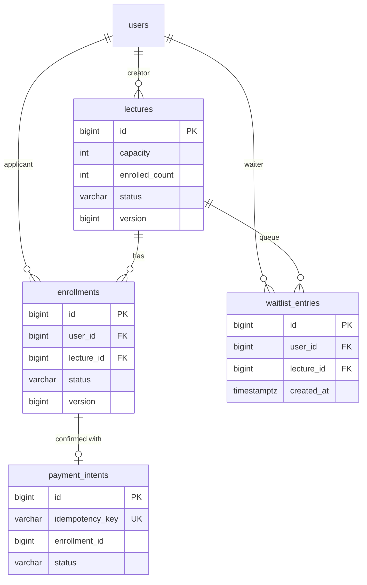

# liveklass-be-assignment — 수강 신청 시스템 (BE-A)

[](https://github.com/dolmaroyujinpark/liveklass-be-assignment/actions/workflows/ci.yml)

크리에이터가 강의를 개설하고 수강생이 신청·결제·취소하는 백엔드 API. 핵심 도전은 **동시성 제어**(마지막 자리 동시 신청)와 **상태 전이 정확성**입니다. 본 README 는 요약본이며, 상세는 [`docs/`](docs) 의 주제별 문서에 분리되어 있습니다.

## 프로젝트 개요

| 항목 | 값 |
|---|---|
| 과제 | BE-A 수강 신청 시스템 (Backend · CRUD + 비즈니스 규칙) |
| 도메인 | 강의 개설/조회/상태 전이, 수강 신청/결제/취소, 대기열 |
| 핵심 도전 | 동시성 제어(정원 경쟁), 상태 전이(FSM), 결제 멱등성 |
| Repository | <https://github.com/dolmaroyujinpark/liveklass-be-assignment> (`main` 브랜치 실행 가능) |

## 기술 스택

| 분류 | 선택 | 이유 |
|---|---|---|
| 언어·프레임워크 | Java 17 · Spring Boot 3.3 | 명세 권장 스택 |
| ORM·DB | Spring Data JPA + Hibernate · **PostgreSQL 16** | 부분 UNIQUE 인덱스 / `FOR UPDATE SKIP LOCKED` / row-level 락 |
| 마이그레이션 | Flyway (`ddl-auto: validate`) | 스키마 변경 추적 |
| API 문서 | springdoc-openapi (Swagger UI) | 자동 문서화 |
| 빌드·CI | Gradle 8.10.2 (Kotlin DSL, wrapper) · GitHub Actions | 환경 의존성 최소화 |
| 테스트 | JUnit 5 · Mockito · Spring Boot Test · Testcontainers · K6 | 단위 + 실 PG 통합 + 부하 |
| 로깅 | logback + logstash JSON encoder + MDC `traceId` | 운영 환경 구조화 로깅 |
| 실행 | Docker Compose | 한 줄 실행 |

## 실행 방법

전제: JDK 17, Docker.

```bash
# 옵션 1 — 로컬 앱 + Docker PostgreSQL (개발용)
docker compose up -d postgres
./gradlew bootRun
curl http://localhost:8080/health        # → {"status":"UP"}

# 옵션 2 — 전부 Docker (한 줄, 평가용)
./gradlew bootJar
docker compose --profile app up
```

- Swagger UI: <http://localhost:8080/swagger-ui.html> (OpenAPI 스펙은 `/v3/api-docs`)
- Actuator: `/actuator/health` · `/actuator/metrics` · `/actuator/prometheus`

**시드 데이터**
- `local` / `docker` 프로필에서 **빈 DB 최초 실행 시** 데모용 시드가 자동 생성됩니다 (결정론적, seed=42 — 사용자 35명: 크리에이터 `id 1~5` · 클래스메이트 `id 6~35`, 강의 20개: DRAFT 3 / OPEN 14 / CLOSED 3).
- 기존 데이터가 있으면 시드는 다시 생성되지 않습니다.
- 시드를 초기화하려면 `docker compose down -v` 후 재실행합니다.

## 구현 범위

명세 분류와 자발적 추가를 4-bucket 으로 정리. 항목별 코드 위치는 [`docs/SCOPE.md`](docs/SCOPE.md).

- **필수 구현 세부 기능 (10)** — 강의 CRUD + 상태 전이 / 수강 신청·결제·취소 / 내 신청 목록 / 정원 초과 거부 / 동시 신청 처리
- **선택 구현 세부 기능 (4)** — 결제 후 7일 취소 제한 / 대기열(만석 시 등록·자동 승급) / 강의별 수강생 조회(크리에이터 전용) / 신청 내역 페이지네이션
- **암묵적 요구** — 동시성 다층 방어 / 결제 멱등성 / 명시적 FSM / 일관된 RFC 7807 에러 응답
- **자발적 차별화** — Testcontainers 동시성 통합 테스트 / K6 부하 / CI / 구조화 로깅 / Swagger / Mermaid 다이어그램

## API 목록 및 예시

전체 명세는 [`docs/API.md`](docs/API.md) 또는 Swagger UI 에 있습니다.

| 메서드 | 경로 | 설명 |
|---|---|---|
| GET | `/health` | 헬스체크 |
| POST | `/api/lectures` | 강의 등록 (CREATOR) |
| GET | `/api/lectures` | 목록 조회 (status 필터, page/size) |
| GET | `/api/lectures/{id}` | 상세 조회 (현재 신청 인원 포함) |
| PATCH | `/api/lectures/{id}/status` | 상태 전이 (작성 크리에이터) |
| GET | `/api/lectures/{id}/enrollments` | 강의별 수강생 (크리에이터 전용) |
| POST | `/api/lectures/{id}/waitlist` | 대기열 등록 (만석일 때만) |
| GET | `/api/lectures/{id}/waitlist` | 대기열 조회 (크리에이터 전용) |
| POST | `/api/enrollments` | 수강 신청 (PENDING) |
| POST | `/api/enrollments/{id}/payment` | 결제 확정 (`Idempotency-Key`) |
| DELETE | `/api/enrollments/{id}` | 수강 취소 |
| GET | `/api/enrollments/me` | 내 수강 신청 목록 |

인증: 상태를 바꾸거나 권한이 필요한 요청에 헤더 `X-User-Id: <userId>` (명세 허용 간이 방식). 에러 응답은 RFC 7807 `application/problem+json` + `code` 식별자.

핵심 흐름 예시 (id 는 예시값 — 실제 fresh seed 기준):
```bash
# 강의 등록(크리에이터 id 1) → OPEN 전환
curl -X POST localhost:8080/api/lectures -H 'X-User-Id: 1' -H 'Content-Type: application/json' \
  -d '{"title":"Spring Boot 백엔드","price":199000,"capacity":20,"startDate":"2026-06-01","endDate":"2026-07-01"}'
curl -X PATCH localhost:8080/api/lectures/21/status -H 'X-User-Id: 1' -H 'Content-Type: application/json' -d '{"status":"OPEN"}'

# 신청(수강생 id 6) → 결제 → 취소
curl -X POST localhost:8080/api/enrollments -H 'X-User-Id: 6' -H 'Content-Type: application/json' -d '{"lectureId":21}'
curl -X POST localhost:8080/api/enrollments/1/payment -H 'X-User-Id: 6' -H 'Idempotency-Key: pay-1-abc'
curl -X DELETE localhost:8080/api/enrollments/1 -H 'X-User-Id: 6'
```

## 데이터 모델 설명

상세 ERD·인덱스·제약은 [`docs/ERD.md`](docs/ERD.md), 스키마 정의는 [`V1__init.sql`](src/main/resources/db/migration/V1__init.sql) · [`V2__enrollment_version.sql`](src/main/resources/db/migration/V2__enrollment_version.sql).



핵심 제약 — `uq_enrollments_active` 부분 UNIQUE (동일 사용자 active 신청 1개, CANCELLED 후 재신청 허용) / `payment_intents.idempotency_key` UNIQUE (결제 멱등성) / `lectures.enrolled_count` 는 활성 신청 수 비정규화 캐시 (비관 락 안에서 ±1, `@Version` 으로 stale write 차단).

## 요구사항 해석 및 가정

비즈니스 규칙 BR-1~11 의 상세 결정은 [`docs/REQUIREMENTS.md`](docs/REQUIREMENTS.md). 핵심:
- **정원 = 활성(PENDING+CONFIRMED) 신청 수** — 결제 직전 사용자도 자리 점유 (BR-7)
- **강의 상태는 단방향 전이** — `CLOSED→OPEN` 등 역전이 불가 (BR-2)
- **CANCELLED 후 재신청 가능** — 부분 UNIQUE 인덱스로 보장 (BR-3)
- **CONFIRMED 후 7일 이내만 취소** — PENDING 은 제한 없음, 기간은 설정값 (BR-6)
- **본인만 자기 신청 취소** · **강의 작성 크리에이터만 강의별 수강생/대기열 조회** (BR-10, 11)
- **대기열은 만석일 때만 등록** — 자리가 남았으면 `WAITLIST_NOT_NEEDED` 로 거부하여 바로 수강 신청 유도. 취소 발생 시 head 1명 자동 PENDING 승급 (BR-8, 9)

## 설계 결정과 이유

| 결정 | 핵심 이유 | 트레이드오프 |
|---|---|---|
| DB로 **PostgreSQL** | 부분 UNIQUE 인덱스 + `FOR UPDATE SKIP LOCKED` 를 우회 없이 사용 (H2 미지원·MySQL 우회 필요) | 의존성 없이 즉시 실행 불가 → Docker Compose / Testcontainers 로 보완 |
| 정원 동시성에 **비관 락** | 정원은 핫스팟이라 낙관 락 단독이면 재시도 루프·tail latency 악화. 비관 락은 직렬화로 재시도 없이 정확. `@Version` 은 락 밖 경로의 stale write 방어 | 같은 강의 신청이 직렬화 — 락 단위가 강의(row)라 전체 시스템은 강의 수만큼 병렬 |
| 결제 확정에 **`Idempotency-Key` + DB UNIQUE** | 재시도·더블 클릭에도 한 번만 처리. 결제 API 의 표준 패턴 | 클라이언트가 요청당 고유 키 관리 필요 |
| **명시적 FSM** 을 도메인 메서드에 | 잘못된 전이를 도메인에서 차단 → `BusinessException` → RFC 7807 ProblemDetail | — |
| **대기열은 만석일 때만 등록** | 자리가 남았는데 대기열에 넣으면 사용자 의도와 어긋남. 명시적 안내가 좋음 | 자리 가용성 체크 한 단계 추가 (`hasAvailableSeat`) |

동시성 4-layer 방어 (비관 락 + `@Version` × 2 entity + 부분 UNIQUE + 멱등성) 의 상세 흐름·시퀀스 다이어그램은 [`docs/CONCURRENCY.md`](docs/CONCURRENCY.md).

## 테스트 실행 방법

```bash
./gradlew test                                                              # 전체 (단위 + Testcontainers 통합)
./gradlew test --tests "com.liveklass.enrollment.concurrency.ConcurrencyTest"  # 동시성만 (Docker 필요)
k6 run load-test/enrollment-burst.k6.js                                     # 부하 (앱 실행 후, k6 설치 필요)
```

테스트 74개 (단위 71 + `ConcurrencyTest` 3) 가 통과합니다. `ConcurrencyTest` 는 Docker 없으면 skip — 빌드는 통과. 리포트는 `build/reports/tests/test/index.html`. 테스트 레이어·검증 포인트 상세는 [`docs/TEST.md`](docs/TEST.md).

## 미구현 / 제약사항

- **인증·인가** — `X-User-Id` 헤더만 (명세 허용). 프로덕션이면 Spring Security + JWT
- **결제 PG 연동** — 외부 시스템 없이 상태 변경으로 대체 (명세 허용). `PaymentIntent` 의 PENDING/FAILED 상태는 스키마에만 존재
- **분산 락** — 단일 인스턴스 + DB row 락으로 정합 보장. 다중 인스턴스 시 Redis Redisson 등 검토 가능
- **PENDING 자동 만료** — 무한 PENDING 점유 방지(예: 24h TTL) 미구현, 운영 정책 미정
- **알림 발송** — BE-A 범위 밖
- **컨트롤러 MockMvc 테스트** — 컨트롤러가 얇은 pass-through 라 서비스/도메인 단위 + 통합 테스트로 핵심 커버. 4xx 응답 포맷(`MISSING_HEADER` 등)은 Swagger 수동 확인으로 검증

## AI 활용 범위

코드·문서·테스트 초안 작성에 AI 도구(Claude)를 사용했으며, 산출물은 작은 단위로 검증·수정한 뒤 의미 단위로 직접 커밋했습니다. 이전 유사 과제에서 놓친 race 카테고리를 의식적으로 매트릭스로 점검해 추가 race 3건(동시 cancel·결제 리플레이 인증·CLOSED 자동 승급) 을 발견·수정한 검증 사이클을 거쳤습니다. 어디에 어떻게 썼고 무엇을 검증했는지는 [`docs/AI_USAGE.md`](docs/AI_USAGE.md) 에 정리.

## 디렉토리 구조

```
liveklass-be-assignment/
├── README.md
├── build.gradle.kts · settings.gradle.kts · gradlew · gradle/
├── Dockerfile · docker-compose.yml
├── .github/workflows/ci.yml
├── load-test/enrollment-burst.k6.js
├── docs/
│   ├── SCOPE.md · REQUIREMENTS.md · ERD.md          # 범위·요구사항·데이터 모델
│   └── API.md · CONCURRENCY.md · TEST.md · AI_USAGE.md
├── src/main/java/com/liveklass/enrollment/
│   ├── EnrollmentApplication.java
│   ├── config/ · common/ (exception, dto, logging, health)
│   ├── lecture/ · enrollment/ · payment/ · waitlist/ · user/   # 모듈별 domain / application / infrastructure / presentation
│   └── seed/SeedRunner.java
├── src/main/resources/ (application.yml · logback-spring.xml · db/migration/V1__init.sql · V2__enrollment_version.sql)
└── src/test/java/com/liveklass/enrollment/
    ├── concurrency/ConcurrencyTest.java                 # @SpringBootTest + Testcontainers
    └── …/ (도메인·서비스·필터 단위 테스트)
```
