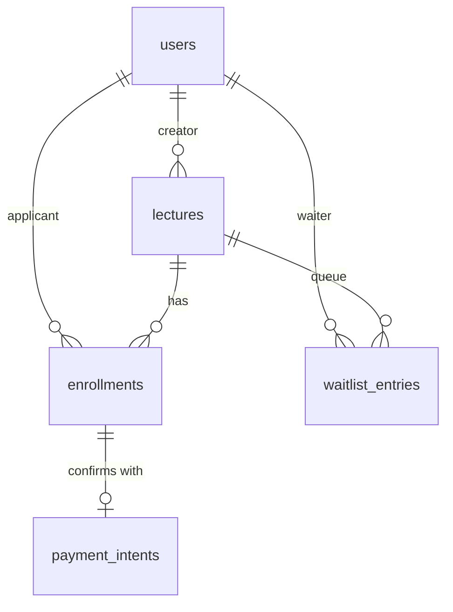

# liveklass-be-assignment

라이브 클래스 프로덕트 엔지니어 채용 과제 — **BE-A 수강 신청 시스템**.

크리에이터가 강의를 개설하고 수강생이 신청·결제·취소하는 백엔드 API. 핵심은 **동시성 제어** 와 **상태 전이 정확성**.

---

## 프로젝트 개요

| 항목 | 값 |
|---|---|
| 과제 | BE-A (Backend, CRUD + 비즈니스 규칙) |
| 도메인 | 수강 신청 (강의 개설/조회, 신청/결제/취소, 대기열) |
| 핵심 도전 | 동시성 제어 (마지막 자리 동시 신청), 상태 전이, 결제 멱등성 |
| 제출자 | 박유진 (kimtae0316@gmail.com) |

---

## 기술 스택

| 분류 | 선택 | 선택 이유 |
|---|---|---|
| 언어 | Java 17 | Spring Boot 표준, 평가자 친화 |
| 프레임워크 | Spring Boot 3.3 | JPA·검증·웹·액추에이터 일체 |
| ORM | Spring Data JPA + Hibernate | 도메인 모델 + 트랜잭션 일관성 |
| DB | PostgreSQL 16 | row-level lock, 부분 UNIQUE 인덱스, `SKIP LOCKED` |
| 마이그레이션 | Flyway | 스키마 변경 추적 |
| 빌드 | Gradle 8.10.2 (Kotlin DSL, wrapper 고정) | 평가자 환경 의존성 최소화 |
| 문서 | springdoc-openapi (Swagger UI) | API 자동 문서화 |
| 테스트 | JUnit 5 + Spring Boot Test + Testcontainers | 실 DB 통합 검증 |
| 부하 테스트 | K6 | 100 VU 동시성 시나리오 |
| 컨테이너 | Docker Compose | 한 줄 실행 |
| CI | GitHub Actions | build / test 자동화 |

---

## 빠른 실행

### 옵션 1 — 로컬 + Docker Compose PostgreSQL

```bash
# 1. PostgreSQL 띄우기
docker compose up -d postgres

# 2. 빌드 + 실행
./gradlew bootRun

# 3. 헬스체크
curl http://localhost:8080/health
# → {"status":"UP"}

# 4. Swagger UI
open http://localhost:8080/swagger-ui.html
```

### 옵션 2 — 전체 Docker Compose

```bash
./gradlew bootJar
docker compose --profile app up
```

---

## 구현 범위 요약

상세 분류는 [docs/SCOPE.md](docs/SCOPE.md) 참조.

| 라벨 | 항목 수 | 내용 |
|---|---|---|
| `[필수]` 명세 핵심 | 10개 | 강의 CRUD/상태 전이, 신청/결제/취소, 내 목록, 정원/동시성 제어 |
| `[선택]` 명세 선택 (추가 점수) | 4개 | 7일 취소 제한, 대기열, 크리에이터 전용 조회, 페이지네이션 |
| `[추가]` 차별화 자발 구현 | 14개 | 멱등성, FSM, 자동 승급, 다층 락, K6, OpenAPI, Docker, CI, JSON 로그, ProblemDetail, ERD, ADR, Actuator, Testcontainers |
| **총** | **28개** | |

---

## 주요 차별화 — `[추가]` 핵심

### 1. 동시성 다층 방어 (4-Layer)
1. **DB row-level lock** — `@Lock(PESSIMISTIC_WRITE)` on Lecture
2. **낙관 락** — `@Version` 컬럼
3. **부분 UNIQUE 인덱스** — `uq_enrollments_active WHERE status <> 'CANCELLED'`
4. **Idempotency-Key** — 결제 확정 재시도 안전

> 무신사 2차 과제 대비: Python `threading.Lock` 단일 프로세스 한계 → DB 기반 멀티 인스턴스 안전.

### 2. 명시적 상태 머신 (FSM)
도메인 객체 메서드 (`Lecture#changeStatus`, `Enrollment#confirm/cancel`) 가 **잘못된 전이를 컴파일/런타임에 차단**. `IllegalStateException` 발생 → ProblemDetail 변환.

### 3. 대기열 자동 승급
취소 발생 → `SELECT ... FOR UPDATE SKIP LOCKED` 로 다음 대기자 1명을 안전하게 PENDING 으로 자동 승급. 다중 인스턴스에서도 race condition 없음.

### 4. K6 동시성 부하 테스트
`load-test/enrollment-burst.k6.js` — 정원 1 / VU 100 / 동시 신청 → 정확히 1명만 성공하는지 검증.

---

## 데이터 모델



상세 — [docs/ERD.md](docs/ERD.md)

---

## API 개요

| 메서드 | 경로 | 설명 | 분류 |
|---|---|---|---|
| GET | `/health` | 헬스체크 | `[필수]` |
| POST | `/api/lectures` | 강의 등록 | `[필수]` |
| GET | `/api/lectures` | 목록 조회 (status 필터, page/size) | `[필수][선택]` |
| GET | `/api/lectures/{id}` | 상세 조회 | `[필수]` |
| PATCH | `/api/lectures/{id}/status` | 상태 전이 | `[필수]` |
| GET | `/api/lectures/{id}/enrollments` | 강의별 수강생 (크리에이터) | `[선택]` |
| POST | `/api/enrollments` | 수강 신청 | `[필수]` |
| POST | `/api/enrollments/{id}/payment` | 결제 확정 (`Idempotency-Key`) | `[필수][추가]` |
| DELETE | `/api/enrollments/{id}` | 수강 취소 | `[필수][선택]` |
| GET | `/api/enrollments/me` | 내 신청 목록 (page/size) | `[필수][선택]` |

요청/응답 예시 — [docs/API.md](docs/API.md) (D2 작성)

인증: 헤더 `X-User-Id: <userId>` (명세에서 허용된 간이 방식).
에러 응답: RFC 7807 `application/problem+json`.

---

## 요구사항 해석 및 가정

[docs/REQUIREMENTS.md](docs/REQUIREMENTS.md) — 명세에 명시되지 않은 11건의 비즈니스 결정 + 근거.

핵심 결정 미리보기:
- **정원 = PENDING + CONFIRMED 합계** (PENDING 도 자리 점유)
- **CANCELLED 후 재신청 가능** (이력 보존, 부분 UNIQUE 인덱스)
- **상태 전이 단방향** (CLOSED → OPEN 불가, OPEN → DRAFT 불가)
- **본인만 자기 신청 취소** / **크리에이터만 강의별 수강생 조회**

---

## 설계 결정과 이유

[docs/ADR/](docs/ADR/) — Architecture Decision Records (D5 마감)
- 0001 — PostgreSQL 선택 (H2 대비)
- 0002 — 비관적 락 vs 낙관적 락 선택 근거
- 0003 — Idempotency-Key 헤더 전략

---

## 미구현 / 제약사항

- **인증/인가**: `X-User-Id` 헤더만 검증. JWT/세션 본격 구현 안 함 (명세 허용)
- **결제 PG 연동**: 단순 상태 변경 (명세 허용)
- **분산 락**: 단일 인스턴스 + DB lock 으로 충분. Redis Redisson 은 향후 확장 사항
- **알림**: BE-A 범위 외 (BE-C 과제 영역)
- **PENDING 자동 만료**: 운영 정책 미정 — 향후 24h TTL 권장 (REQUIREMENTS BR-7 참조)

---

## 테스트 실행 방법

```bash
# 전체 테스트
./gradlew test

# 동시성 시나리오만
./gradlew test --tests ConcurrencyTest

# K6 부하 테스트 (앱 실행 후)
k6 run load-test/enrollment-burst.k6.js
```

테스트 전략 — [docs/TEST.md](docs/TEST.md) (D5 작성)

---

## AI 활용 범위

[docs/AI_USAGE.md](docs/AI_USAGE.md) — D5 마감.

요약: 도메인 모델 설계, 동시성 전략 검토, ADR 초안, 문서 구조에 Claude (claude-opus-4-7) 와 협업. 코드/문서/테스트 모두 작성자가 검증 및 직접 수정. AI 가 제안했지만 거절한 케이스도 명시.

---

## 디렉토리 구조

```
liveklass-be-assignment/
├── README.md                    # 본 문서
├── docker-compose.yml           # PostgreSQL + 앱
├── Dockerfile
├── build.gradle.kts
├── settings.gradle.kts
├── gradlew, gradlew.bat
├── gradle/wrapper/...
├── docs/
│   ├── SCOPE.md                 # 필수/선택/추가 분류 상세
│   ├── REQUIREMENTS.md          # 요구사항 분석 + 11개 결정
│   ├── ERD.md                   # 데이터 모델
│   ├── API.md                   # API 명세 (D2)
│   ├── CONCURRENCY.md           # 동시성 전략 (D5)
│   ├── TEST.md                  # 테스트 전략 (D5)
│   ├── AI_USAGE.md              # AI 활용 (D5)
│   └── ADR/                     # 의사결정 기록
├── prompts/                     # AI 프롬프트 이력 (D5 정리)
├── load-test/                   # K6 부하 테스트 (D5)
├── src/main/java/com/liveklass/enrollment/
│   ├── EnrollmentApplication.java
│   ├── common/
│   ├── config/
│   ├── lecture/
│   ├── enrollment/
│   ├── payment/
│   ├── waitlist/
│   ├── user/
│   └── seed/
├── src/main/resources/
│   ├── application.yml
│   └── db/migration/V1__init.sql
└── src/test/java/com/liveklass/enrollment/
    ├── ConcurrencyTest.java
    ├── IdempotencyTest.java
    ├── ...
```

---

## 진행 상태 (D1 ~ D5)

- [x] **D1** — 스캐폴드, Docker Compose, JPA 엔티티, Flyway, 시드, 문서 초안
- [ ] **D2** — Lecture API + 상태 전이 + OpenAPI
- [ ] **D3** — Enrollment 필수 + 동시성 제어 + ConcurrencyTest
- [ ] **D4** — 멱등성 + 대기열 자동 승급 + 페이지네이션
- [ ] **D5** — K6 부하 + CI + 구조화 로깅 + 문서 마감
