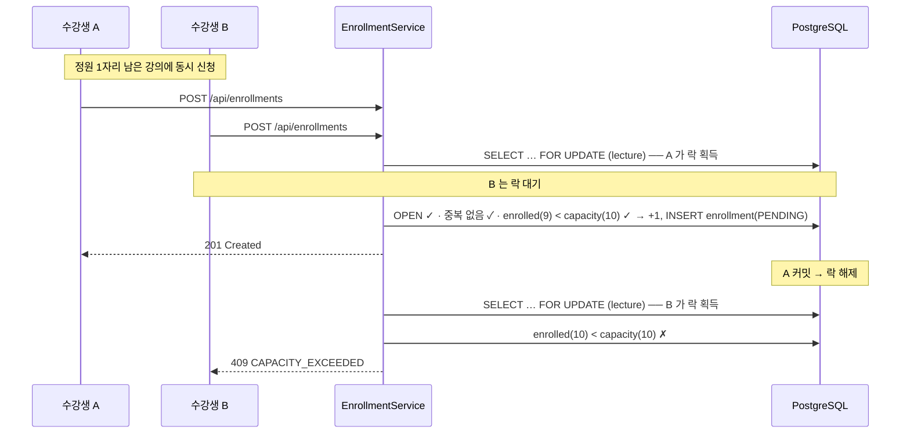

# liveklass-be-assignment — 수강 신청 시스템 (BE-A)

[](https://github.com/dolmaroyujinpark/liveklass-be-assignment/actions/workflows/ci.yml)

크리에이터가 강의를 개설하고 수강생이 신청·결제·취소하는 백엔드 API. 핵심 도전은 **동시성 제어**(마지막 자리 동시 신청)와 **상태 전이 정확성**.

---

## 프로젝트 개요

| 항목 | 값 |
|---|---|
| 과제 | BE-A 수강 신청 시스템 (Backend · CRUD + 비즈니스 규칙) |
| 도메인 | 강의 개설/조회/상태 전이, 수강 신청/결제/취소, 대기열 |
| 핵심 도전 | 동시성 제어(정원 경쟁), 상태 전이(FSM), 결제 멱등성 |
| 제출 | GitHub: [dolmaroyujinpark/liveklass-be-assignment](https://github.com/dolmaroyujinpark/liveklass-be-assignment), `main` 브랜치 실행 가능 |

---

## 기술 스택

| 분류 | 선택 | 이유 |
|---|---|---|
| 언어 / 프레임워크 | Java 17 · Spring Boot 3.3 | 명세 권장 스택, 평가자 친화 |
| ORM | Spring Data JPA + Hibernate | 도메인 모델 + 트랜잭션 일관성 |
| DB | **PostgreSQL 16** | 부분 UNIQUE 인덱스, `SELECT … FOR UPDATE SKIP LOCKED`, row-level 락 (아래 "설계 결정과 이유") |
| 마이그레이션 | Flyway (`ddl-auto: validate`) | 스키마 변경 추적 |
| API 문서 | springdoc-openapi (Swagger UI) | 자동 문서화 |
| 빌드 | Gradle 8.10.2 (Kotlin DSL, wrapper 고정) | 평가자 환경 의존성 최소화 |
| 테스트 | JUnit 5 · Mockito · Spring Boot Test · **Testcontainers** | 단위 + 실 PostgreSQL 통합 |
| 부하 테스트 | K6 | 동시 신청 시나리오 |
| 로깅 | logback + logstash-logback-encoder (JSON) + MDC traceId | 운영 환경 구조화 로깅 |
| 컨테이너 / CI | Docker Compose · GitHub Actions | 한 줄 실행 + 자동 빌드·테스트 |

자유 라이브러리 선택은 위 표의 "이유" 및 아래 "설계 결정과 이유" 섹션 참조.

---

## 실행 방법

전제: JDK 17, Docker.

### 옵션 1 — 로컬 앱 + Docker PostgreSQL (개발용)
```bash
docker compose up -d postgres            # PostgreSQL 16 (포트 5432)
./gradlew bootRun                        # 앱 (포트 8080), local 프로필 — 시드 데이터 자동 생성
curl http://localhost:8080/health        # → {"status":"UP"}
```

### 옵션 2 — 전부 Docker (한 줄, 평가용)
```bash
./gradlew bootJar
docker compose --profile app up          # 앱 + PostgreSQL, docker 프로필 — 시드 자동, JSON 로그
```

- Swagger UI: <http://localhost:8080/swagger-ui.html>, OpenAPI 스펙: `/v3/api-docs`
- Actuator: `/actuator/health` (DB 연결 포함), `/actuator/metrics`, `/actuator/prometheus`
- 시드를 새로 받으려면: `docker compose down -v` 후 다시 up (DB 볼륨 삭제)
- 시드(결정론적, seed=42): 사용자 35명(크리에이터 id 1~5, 클래스메이트 id 6~35), 강의 20개(DRAFT 3 / OPEN 14 / CLOSED 3)

---

## 구현 범위

라벨: `[필수]` 명세 핵심 / `[선택]` 명세 선택(추가 점수) / `[추가]` 자발적 차별화. 상세 분류는 [docs/SCOPE.md](docs/SCOPE.md).

- **`[필수]` 10/10** — 강의 등록/상태전이(DRAFT→OPEN→CLOSED)/목록(status 필터)/상세(신청 인원 포함), 수강 신청/결제 확정/취소/내 신청 목록, 정원 초과 거부, 동시성 제어.
- **`[선택]` 4/4** — 결제 후 7일 이내 취소 제한 · 대기열(등록·크리에이터 조회) · 강의별 수강생 목록(크리에이터 전용) · 신청 내역 페이지네이션 (+ 강의 목록 페이지네이션).
- **`[추가]` (차별화)** — 결제 멱등성(Idempotency-Key) · 명시적 FSM · 대기열 자동 승급(`FOR UPDATE SKIP LOCKED`) · 동시성 다층 방어(비관 락 + `@Version` + 부분 UNIQUE 인덱스) · Testcontainers 동시성 통합 테스트 · K6 부하 테스트 · OpenAPI/Swagger · RFC 7807 ProblemDetail 에러 응답 · 구조화 로깅(JSON + traceId) · Docker Compose · GitHub Actions CI · Actuator · Mermaid ERD/시퀀스 다이어그램 · ADR 3건.

---

## API 목록 및 예시

전체 명세·요청/응답 예시·에러 코드 표는 [docs/API.md](docs/API.md), 인터랙티브 문서는 Swagger UI.

| 메서드 | 경로 | 설명 | 분류 |
|---|---|---|---|
| GET | `/health` | 헬스체크 | `[필수]` |
| POST | `/api/lectures` | 강의 등록 (CREATOR) | `[필수]` |
| GET | `/api/lectures` | 목록 조회 (status 필터, page/size) | `[필수][선택]` |
| GET | `/api/lectures/{id}` | 상세 조회 (현재 신청 인원 포함) | `[필수]` |
| PATCH | `/api/lectures/{id}/status` | 상태 전이 (작성 크리에이터) | `[필수]` |
| GET | `/api/lectures/{id}/enrollments` | 강의별 수강생 목록 (크리에이터 전용, page/size) | `[선택]` |
| POST | `/api/lectures/{id}/waitlist` | 대기열 등록 | `[선택]` |
| GET | `/api/lectures/{id}/waitlist` | 대기열 조회 (크리에이터 전용, page/size) | `[선택]` |
| POST | `/api/enrollments` | 수강 신청 (PENDING) | `[필수]` |
| POST | `/api/enrollments/{id}/payment` | 결제 확정 (`Idempotency-Key` 헤더) | `[필수][추가]` |
| DELETE | `/api/enrollments/{id}` | 수강 취소 | `[필수][선택]` |
| GET | `/api/enrollments/me` | 내 수강 신청 목록 (page/size) | `[필수][선택]` |

- 인증: 상태를 바꾸는/권한 필요한 요청은 헤더 `X-User-Id: <userId>` (명세 허용 간이 방식). 인가는 역할 검사(CREATOR) + 소유자 검사(강의 작성자/신청 본인).
- 에러 응답: RFC 7807 `application/problem+json` — `{ type, title, status, detail, code }`.

예시:
```bash
# 강의 등록 (크리에이터 id 1) → OPEN 전환
curl -X POST localhost:8080/api/lectures -H 'X-User-Id: 1' -H 'Content-Type: application/json' \
  -d '{"title":"Spring Boot 백엔드","price":199000,"capacity":20,"startDate":"2026-06-01","endDate":"2026-07-01"}'
curl -X PATCH localhost:8080/api/lectures/21/status -H 'X-User-Id: 1' -H 'Content-Type: application/json' -d '{"status":"OPEN"}'

# 신청 (수강생 id 6) → 결제 → 취소
curl -X POST localhost:8080/api/enrollments -H 'X-User-Id: 6' -H 'Content-Type: application/json' -d '{"lectureId":21}'
curl -X POST localhost:8080/api/enrollments/101/payment -H 'X-User-Id: 6' -H 'Idempotency-Key: pay-101-abc'
curl -X DELETE localhost:8080/api/enrollments/101 -H 'X-User-Id: 6'
```

---

## 데이터 모델 설명

```mermaid
erDiagram
    users ||--o{ lectures : creator
    users ||--o{ enrollments : applicant
    users ||--o{ waitlist_entries : waiter
    lectures ||--o{ enrollments : has
    lectures ||--o{ waitlist_entries : queue
    enrollments ||--o| payment_intents : "confirmed with"

    users { bigint id PK; varchar name; varchar role "CREATOR|CLASSMATE" }
    lectures { bigint id PK; bigint creator_id FK; varchar title; numeric price; int capacity; int enrolled_count "비정규화 카운터"; date start_date; date end_date; varchar status "DRAFT|OPEN|CLOSED"; bigint version "@Version 낙관 락" }
    enrollments { bigint id PK; bigint user_id FK; bigint lecture_id FK; varchar status "PENDING|CONFIRMED|CANCELLED"; timestamptz applied_at; timestamptz confirmed_at; timestamptz cancelled_at; bigint payment_intent_id FK }
    payment_intents { bigint id PK; varchar idempotency_key "UNIQUE"; bigint enrollment_id; varchar status "PENDING|COMPLETED|FAILED" }
    waitlist_entries { bigint id PK; bigint user_id FK; bigint lecture_id FK; timestamptz created_at "FIFO 정렬키" }
```

핵심 제약/인덱스:
- **`uq_enrollments_active`** — `UNIQUE (user_id, lecture_id) WHERE status <> 'CANCELLED'` (부분 인덱스): 동일 사용자가 동일 강의에 active 신청 1개만, CANCELLED 는 이력으로 남기고 재신청 허용.
- **`payment_intents.idempotency_key UNIQUE`** — 결제 확정 멱등성의 최종 방어선.
- `uq_waitlist_user_lecture UNIQUE (user_id, lecture_id)`, `idx_lectures_status`, `idx_enrollments_lecture_status`, `idx_enrollments_user_status`, `idx_waitlist_lecture_created`.
- `lectures.enrolled_count` 는 활성 신청 수(PENDING+CONFIRMED)를 캐시한 비정규화 컬럼 — 신청/취소 시 `Lecture` row 비관 락 안에서 ±1, `@Version` 으로 stale write 차단.

상세는 [docs/ERD.md](docs/ERD.md), 스키마 정의는 [`src/main/resources/db/migration/V1__init.sql`](src/main/resources/db/migration/V1__init.sql).

---

## 동시성 제어 (핵심)

마지막 자리에 동시에 여러 명이 신청해도 **정확히 정원 수만 성공**한다 — `Lecture` row 에 `SELECT … FOR UPDATE` (비관 락) 를 걸어 신청 처리를 직렬화한다.



4-Layer 방어: ① row-level 비관 락(직렬화) ② `@Version` 낙관 락(stale write 차단 → `OPTIMISTIC_LOCK_CONFLICT`) ③ 부분 UNIQUE 인덱스(동일 강의 중복 신청 → `DATA_INTEGRITY_VIOLATION`) ④ `Idempotency-Key` UNIQUE(결제 경합). 취소로 자리가 비면 대기열의 다음 사람을 `FOR UPDATE SKIP LOCKED` 로 안전하게 한 명 잡아 PENDING 자동 승급.

> 이전에 수행한 유사 과제(Python/FastAPI)는 `threading.Lock` (단일 프로세스 한정) 에 의존했는데, 이번엔 DB 기반이라 다중 인스턴스에서도 정합이 보장된다.

상세 — [docs/CONCURRENCY.md](docs/CONCURRENCY.md). 검증 — `./gradlew test --tests ConcurrencyTest` (Testcontainers), `k6 run load-test/enrollment-burst.k6.js`.

---

## 요구사항 해석 및 가정

명세에 명시되지 않은 비즈니스 결정 11건(BR-1~11)과 근거는 [docs/REQUIREMENTS.md](docs/REQUIREMENTS.md). 핵심:
- **정원 = 활성(PENDING+CONFIRMED) 신청 수** — 결제 직전 사용자도 자리를 점유.
- **강의 상태는 단방향 전이** — `CLOSED→OPEN` 등 역전이/단계 건너뛰기 불가.
- **CANCELLED 후 재신청 가능** — 이력 보존(부분 UNIQUE 인덱스).
- **CONFIRMED 후 7일 이내만 취소** (PENDING 은 제한 없음). 기간은 설정값(`enrollment.refund-window`).
- **본인만 자기 신청 취소** / **강의 작성 크리에이터만 강의별 수강생·대기열 조회**.
- 대기열은 자동 등록(옵트아웃)이 아니라 **명시적 등록 엔드포인트** (`POST /api/lectures/{id}/waitlist`); 취소 발생 시 head 1명 자동 승급.

---

## 설계 결정과 이유

**PostgreSQL 16 (H2/MySQL 대신)** — 핵심 규칙인 "동일 사용자가 동일 강의에 active 신청 1개, 취소 후 재신청은 허용"을 부분 UNIQUE 인덱스(`WHERE status <> 'CANCELLED'`)로 DB 레벨에서 그대로 표현하려 했다. H2 는 부분 인덱스 미지원, MySQL 8.0 은 생성 컬럼으로 우회해야 한다. 대기열 자동 승급의 `SELECT … FOR UPDATE SKIP LOCKED` 도 PostgreSQL 이 가장 검증돼 있다. 트레이드오프: H2 in-memory 처럼 의존성 없이 즉시 실행은 안 되므로 Docker Compose 로 보완하고, 통합 테스트는 Testcontainers 로 실 PostgreSQL 을 띄운다.

**정원 동시성에 비관 락 (낙관 락 단독 대신)** — `lectures.enrolled_count` 는 경합이 몰리는 핫스팟이다. 낙관 락(`@Version`) 단독이면 동시 N명 중 1명만 커밋 성공하고 나머지는 충돌 → 재시도 루프를 직접 구현해야 하고 경합이 심하면 tail latency 가 나빠진다. 신청/취소 시 `Lecture` row 에 `SELECT … FOR UPDATE` 를 잡으면 차례로 직렬화돼 재시도 없이 정확하고, "락 잡은 뒤 검사 = 커밋되는 상태"라 OPEN/중복/정원 검사 로직이 단순하며, 단일 row 단위라 데드락 여지가 없다. `@Version` 은 비관 락 범위 밖 경로(마이그레이션·어드민 SQL·버그)의 stale write 를 잡는 보조 방어로 함께 둔다(→ `OPTIMISTIC_LOCK_CONFLICT` 409). 트레이드오프: 같은 강의 신청이 직렬화돼 단일 강의 throughput 상한이 있으나, 락 단위가 강의(row)라 시스템 전체는 강의 수만큼 병렬이고 한 신청 트랜잭션이 짧다.

**결제 확정에 Idempotency-Key 헤더 + DB UNIQUE** — 실무에서 결제는 멱등성이 필수다(재시도·더블 클릭·타임아웃 후 재요청). `POST /api/enrollments/{id}/payment` 에 `Idempotency-Key` 헤더를 필수로 하고 `payment_intents.idempotency_key` 에 UNIQUE 제약을 건다. 같은 키 재호출 시 상태 변경 없이 동일 응답, 다른 신청에 같은 키면 `IDEMPOTENCY_KEY_CONFLICT`, 동시 경합은 UNIQUE 가 최종 방어. 헤더 기반 멱등 키는 결제 API(Stripe 등)의 표준 패턴이라 의도가 명확하다. 트레이드오프: 클라이언트가 키를 관리해야 한다(요청당 고유 키, 재시도 시 동일 키).

**그 외** — 상태 전이 검증을 도메인 객체 메서드(`Lecture#changeStatus`, `Enrollment#confirm/cancel`)에 둬 잘못된 전이를 도메인 단계에서 차단하고, 서비스가 `BusinessException`(+ `ErrorCode` enum)으로 래핑 → `GlobalExceptionHandler` 가 RFC 7807 ProblemDetail 로 변환. 페이지네이션 응답은 Spring 의 `Page` 직접 직렬화 시 JSON 구조가 불안정하다는 경고가 있어 `PageResponse<T>` 레코드로 감쌌다. 동시성 4-layer 방어 상세는 [docs/CONCURRENCY.md](docs/CONCURRENCY.md).

---

## 테스트 실행 방법

```bash
./gradlew test                                              # 전체 (단위 + Testcontainers 통합)
./gradlew test --tests "com.liveklass.enrollment.concurrency.ConcurrencyTest"  # 동시성만 (Docker 필요)
k6 run load-test/enrollment-burst.k6.js                     # 부하 (앱 실행 후, k6 설치 필요)
```
- 단위/통합 테스트 ~69개 통과. `ConcurrencyTest` 는 Docker 미실행 시 skip(빌드는 통과).
- 리포트: `build/reports/tests/test/index.html`. CI: push 마다 GitHub Actions 가 `./gradlew build` 실행.
- 테스트 레이어·검증 포인트 상세 — [docs/TEST.md](docs/TEST.md).
- macOS Docker Desktop 에서 Testcontainers 연결 설정은 `build.gradle.kts` 의 테스트 태스크에 포함돼 있어 추가 설정 없이 동작 (Linux/CI 무영향).

---

## 미구현 / 제약사항

- **인증/인가**: `X-User-Id` 헤더만(명세 허용). JWT/세션·비밀번호·리프레시 토큰 미구현 — 프로덕션이면 Spring Security + JWT 로 교체.
- **결제 PG 연동**: 외부 결제 시스템 연동 없이 상태 변경으로 대체(명세 허용). `PaymentIntent` 의 PENDING/FAILED 라이프사이클은 스키마에만 존재(현재 흐름은 COMPLETED 만 사용).
- **분산 락**: 단일 인스턴스 + DB row 락으로 정합 보장. 다중 인스턴스로 스케일 아웃 시 Redis(Redisson) 등을 검토할 수 있으나 본 과제 범위 외.
- **PENDING 자동 만료**: 무한 PENDING 점유 방지 정책(예: 24h TTL 후 자동 취소)은 미구현 — 운영 정책 미정(REQUIREMENTS BR-7 참조).
- **알림 발송**: BE-A 범위 외.
- **컨트롤러 MockMvc 테스트**: 컨트롤러가 얇은 pass-through라 서비스/도메인 단위 + 통합 테스트로 핵심 커버. 여력이 있으면 `@WebMvcTest` 로 에러 응답 포맷 검증 추가 가능.

---

## AI 활용 범위

AI 코딩 도구(Claude)를 페어 프로그래밍 파트너로 사용 — AI 가 코드·문서·테스트 초안을 생성하면 작성자가 읽고 이해한 뒤 검증·수정·테스트했고, 설계 선택은 작성자가 판단해 결정했으며, 커밋은 작성자가 직접 작성·커밋했다(공동 저자 표기 없음). "그대로 복사한 산출물"이 아니라 작성자가 통제·책임지는 결과물.

어디에/어떻게 썼는지, 직접 조정한 부분, AI 제안을 거절·변경한 케이스, 검증 방법은 [docs/AI_USAGE.md](docs/AI_USAGE.md).

---

## 디렉토리 구조

```
liveklass-be-assignment/
├── README.md
├── build.gradle.kts · settings.gradle.kts · gradlew · gradle/
├── Dockerfile · docker-compose.yml
├── .github/workflows/ci.yml
├── load-test/enrollment-burst.k6.js
├── docs/
│   ├── SCOPE.md · REQUIREMENTS.md · ERD.md          # 범위 분류 · 요구사항 결정 · 데이터 모델
│   └── API.md · CONCURRENCY.md · TEST.md · AI_USAGE.md
├── src/main/java/com/liveklass/enrollment/
│   ├── EnrollmentApplication.java
│   ├── config/ (OpenApiConfig)
│   ├── common/ (exception, dto, logging, health)
│   ├── lecture/ · enrollment/ · payment/ · waitlist/ · user/   # 각 domain / application / infrastructure / presentation
│   └── seed/SeedRunner.java
├── src/main/resources/ (application.yml · logback-spring.xml · db/migration/V1__init.sql)
└── src/test/java/com/liveklass/enrollment/
    ├── concurrency/ConcurrencyTest.java                 # @SpringBootTest + Testcontainers
    └── …/ (도메인·서비스·필터 단위 테스트)
```
