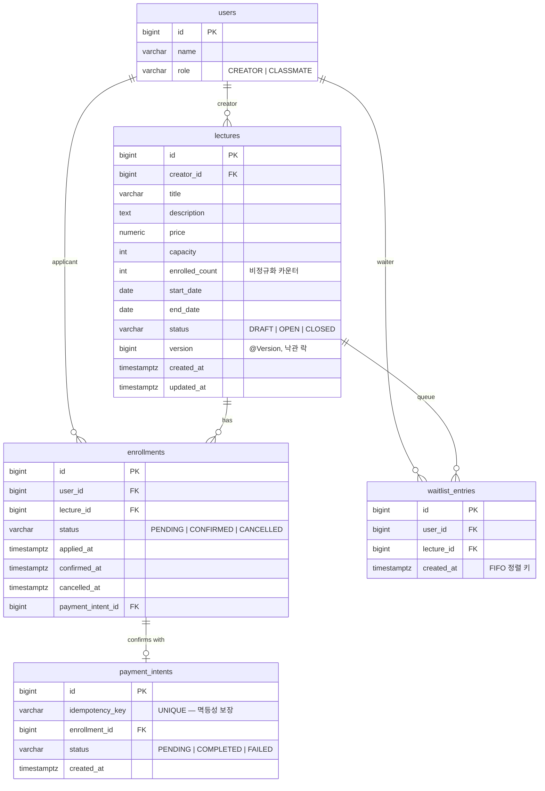

# ERD 및 데이터 모델

## 1. ERD



---

## 2. 핵심 인덱스

| 인덱스 | 목적 | 분류 |
|---|---|---|
| `idx_lectures_status` | 강의 목록 조회 시 status 필터 | `[필수]` |
| `idx_lectures_creator` | 크리에이터 본인 강의 조회 | `[선택]` |
| `idx_enrollments_lecture_status` | 강의별 수강생 조회 | `[선택]` |
| `idx_enrollments_user_status` | 내 신청 목록 조회 | `[필수]` |
| `idx_payment_intents_enrollment` | enrollment_id 로 결제 의도 추적 | `[추가]` |
| `idx_waitlist_lecture_created` | 대기열 FIFO 조회 (`SKIP LOCKED`) | `[추가]` |
| **`uq_enrollments_active`** (부분 UNIQUE) | 동일 사용자 active enrollment 1개만 | **`[추가]` 동시성 다층 방어 핵심** |
| `payment_intents.idempotency_key` (UNIQUE) | 결제 확정 멱등성 | **`[추가]` Idempotency-Key 핵심** |

---

## 3. 비정규화 결정 — `lectures.enrolled_count`

### 결정
강의별 활성 신청 수를 매번 `COUNT(*)` 으로 계산하지 않고 `lectures.enrolled_count` 컬럼에 캐시.

### 근거
- 강의 목록 조회 시 모든 강의의 신청 인원 표시 필요 → JOIN COUNT 는 N+1 또는 비싼 group by
- 단일 SELECT 로 빠르게 표시 가능

### 정합성 보장
- 신청/취소 시 `Lecture` row 에 `PESSIMISTIC_WRITE` 락 → 카운터 ±1 + INSERT/UPDATE enrollment 가 동일 트랜잭션
- `@Version` 으로 stale write 추가 차단
- Sanity check 테스트 (`ConcurrencyTest`) 에서 `enrolled_count == COUNT(active enrollments)` 검증

---

## 4. 부분 UNIQUE 인덱스 — `uq_enrollments_active`

```sql
CREATE UNIQUE INDEX uq_enrollments_active
    ON enrollments(user_id, lecture_id)
    WHERE status <> 'CANCELLED';
```

### 의미
- 동일 사용자 / 동일 강의 조합에 대해 `PENDING` 이나 `CONFIRMED` 가 동시에 2개 이상 존재 불가
- `CANCELLED` 상태는 이력으로 남기고 재신청 가능

### 왜 PostgreSQL 인가
부분 인덱스는 PostgreSQL 의 표준 기능. MySQL 8.0 에서는 직접 지원 안 되며 우회 (생성 컬럼 + 함수) 필요. H2 도 미지원.

---

## 5. 외래 키 정책

- `lectures.creator_id → users.id`: 강의는 크리에이터 삭제 시 cascade 하지 않고 보존 (이력)
- `enrollments.user_id → users.id`: 사용자 삭제 시 신청 이력 보존
- `enrollments.lecture_id → lectures.id`: 강의 삭제 시 신청도 보존 (감사 로그)
- `enrollments.payment_intent_id → payment_intents.id`: NULL 허용 (PENDING 상태)

본 과제 범위에서는 사용자/강의 삭제 시나리오 없음. FK 만 정의하고 cascade 전략은 운영 단계에서 결정.
