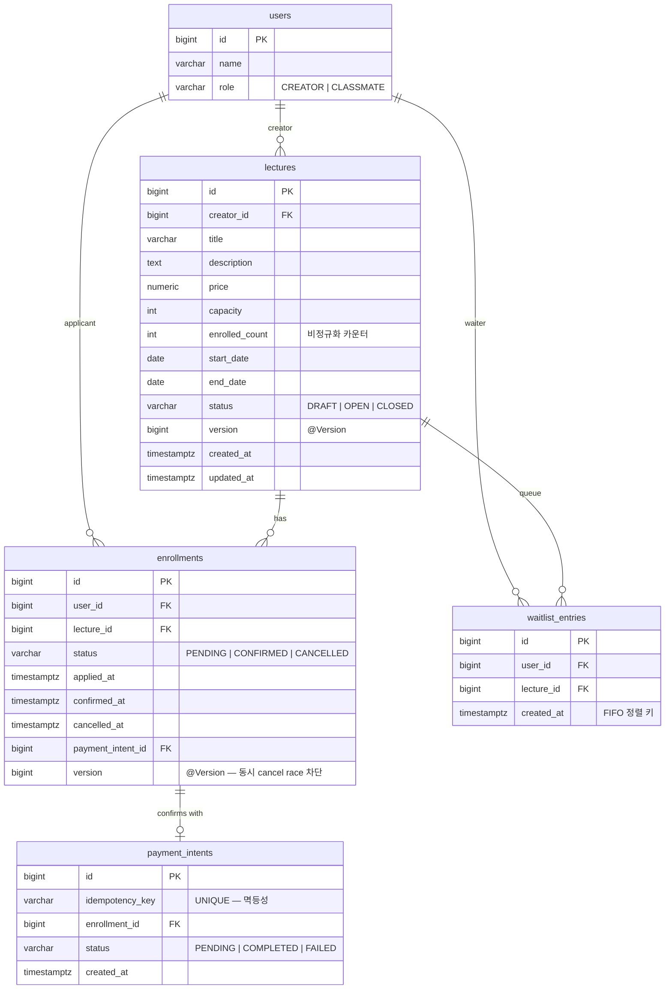

# ERD 및 데이터 모델

스키마 원본: [`V1__init.sql`](../src/main/resources/db/migration/V1__init.sql) · [`V2__enrollment_version.sql`](../src/main/resources/db/migration/V2__enrollment_version.sql).

## ERD

## 핵심 인덱스·제약

| 이름 | 목적 |
|---|---|
| `uq_enrollments_active` (부분 UNIQUE) — `(user_id, lecture_id) WHERE status <> 'CANCELLED'` | 동일 사용자 active 신청 1개, CANCELLED 후 재신청 허용 |
| `payment_intents.idempotency_key` UNIQUE | 결제 멱등성 |
| `uq_waitlist_user_lecture` UNIQUE `(user_id, lecture_id)` | 대기열 중복 방지 |
| `idx_lectures_status` | 강의 목록 status 필터 |
| `idx_enrollments_user_status` | 내 신청 목록 |
| `idx_enrollments_lecture_status` | 강의별 수강생 조회 |
| `idx_waitlist_lecture_created` | 대기열 FIFO 조회 (`SKIP LOCKED`) |

## 비정규화 — `lectures.enrolled_count`

활성 신청 수(PENDING+CONFIRMED)를 캐시. 목록 조회 시 매번 COUNT 하는 비용을 피하기 위함.

정합성 보장:
- 신청/취소 시 `Lecture` row 비관 락 안에서 ±1
- `Lecture.@Version` + `Enrollment.@Version` 으로 stale write 차단
- `ConcurrencyTest` 가 `enrolled_count == COUNT(active)` sanity check

## 부분 UNIQUE 인덱스

PostgreSQL 의 부분 인덱스로 "active 한 신청만" UNIQUE 제약. MySQL/H2 는 미지원이라 PG 채택 이유 중 하나.

## 외래 키 정책

- 모든 FK 는 `ON DELETE` cascade 없음 — 이력 보존
- `enrollments.payment_intent_id` 는 NULL 허용 (PENDING 상태)
- 사용자/강의 삭제 시나리오는 본 과제 범위 외
